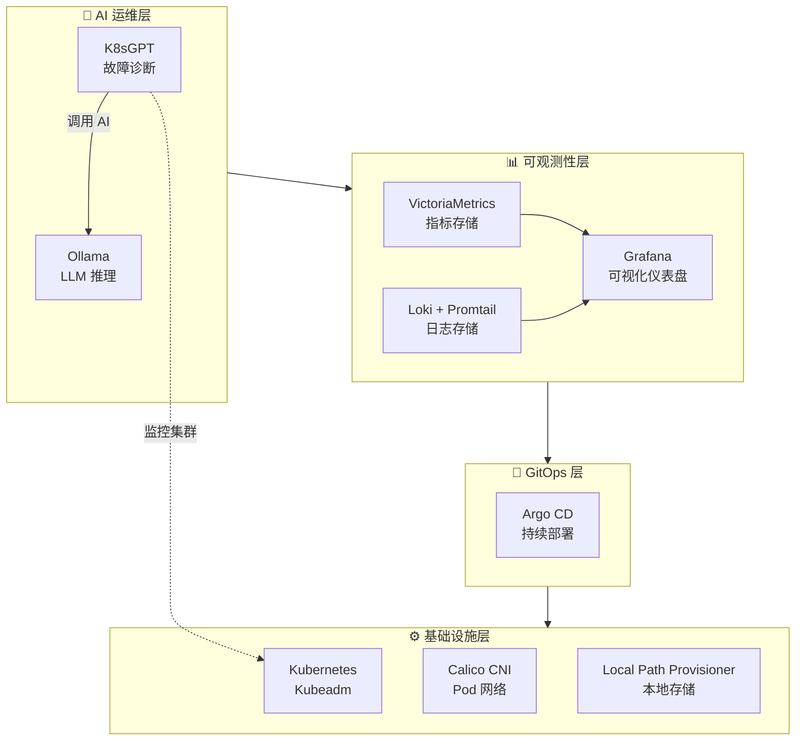
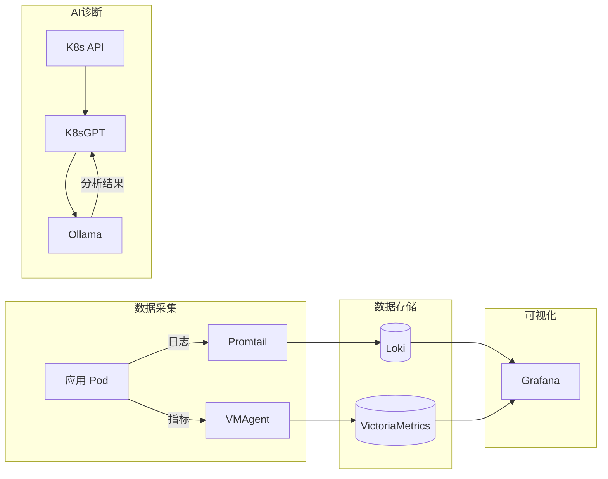

# qwq-ops Platform 🚀

[](https://kubernetes.io/)
[](https://k8sgpt.ai/)
[](https://argoproj.github.io/cd/)

**qwq-ops** 是一个基于标准 Kubernetes (Kubeadm) 构建的下一代云原生 AIOps 底座。
本项目旨在单节点裸金属服务器（Ubuntu 22.04）上，从零搭建一套集成了**可观测性**、**GitOps** 和 **本地私有化 AI 运维能力** 的生产级平台。

---

# AIOps 平台部署指南

基于 Kubernetes (Kubeadm) 的现代化 AIOps 平台，集成完整的可观测性（Observability）能力和 AI 运维能力。

## 🚀 快速开始

```bash
# 1. 克隆并进入目录
git clone https://github.com/QwQBiG/qwq-ops.git
cd qwq-ops

# 2. 添加执行权限
chmod +x *.sh

# 3. 安装 Helm (如果未安装)
curl https://raw.githubusercontent.com/helm/helm/main/scripts/get-helm-3 | bash

# 4. 一键部署 (按顺序执行)
sudo ./01_init_k8s.sh              # 初始化 K8s 集群 (~10分钟)
sudo ./02_setup_storage.sh         # 配置存储类 (~1分钟)
sudo ./03_deploy_stack.sh          # 部署 AIOps 技术栈 (~15分钟)
kubectl apply -f k8sgpt_integration.yaml  # 应用集成配置

# 5. 验证部署
./verify_deployment.sh
```

### 国内网络一键部署

```bash
# 使用阿里云镜像源初始化集群
sudo ./01_init_k8s.sh --use-aliyun-mirror
sudo ./02_setup_storage.sh
sudo ./03_deploy_stack.sh --model qwen:1.8b  # 使用中文友好的小模型
kubectl apply -f k8sgpt_integration.yaml
./verify_deployment.sh
```

## 📋 部署前检查清单

在开始部署前，请确认以下条件：

```bash
# 1. 检查操作系统版本
cat /etc/os-release | grep -E "^(NAME|VERSION)="
# 期望输出: Ubuntu 22.04 LTS

# 2. 检查 CPU 核心数 (最低 4 核)
nproc
# 期望输出: >= 4

# 3. 检查内存大小 (最低 8GB，推荐 16GB)
free -h | grep Mem
# 期望输出: 总内存 >= 8Gi

# 4. 检查磁盘空间 (最低 50GB)
df -h /
# 期望输出: 可用空间 >= 50G

# 5. 检查网络连通性
ping -c 3 google.com || ping -c 3 baidu.com
# 期望输出: 能够 ping 通

# 6. 检查是否有 root 权限
sudo whoami
# 期望输出: root
```

## 🏗️ 平台架构



### 数据流向



## 📦 组件清单

| 组件 | 版本 | 命名空间 | 用途 |
|------|------|----------|------|
| Kubernetes | 1.28+ | - | 容器编排平台 |
| Calico | v3.26.4 | calico-system | 网络插件 (CNI) |
| Local Path Provisioner | v0.0.26 | local-path-storage | 本地存储 |
| VictoriaMetrics | latest | monitoring | 指标存储 |
| Grafana | latest | monitoring | 可视化仪表盘 |
| Loki | latest | logging | 日志聚合 |
| Promtail | latest | logging | 日志采集 |
| Argo CD | latest | argocd | GitOps 持续部署 |
| Ollama | latest | ai | LLM 推理引擎 |
| K8sGPT | latest | k8sgpt | AI 故障诊断 |

## 💻 硬件要求

| 配置项 | 最低要求 | 推荐配置 | 说明 |
|--------|----------|----------|------|
| CPU | 4 vCPU | 8 vCPU | AI 推理需要较多 CPU |
| 内存 | 8 GB | 16 GB | LLM 模型需要大量内存 |
| 磁盘 | 50 GB | 100 GB SSD | 日志和指标存储 |
| 网络 | 1 Gbps | 1 Gbps | 镜像拉取和服务通信 |

## 📝 详细部署步骤

### 步骤 1: 初始化 Kubernetes 集群

```bash
sudo ./01_init_k8s.sh
# 或使用阿里云镜像 (国内推荐)
sudo ./01_init_k8s.sh --use-aliyun-mirror
```

**执行内容:**
- ✅ 禁用 swap 并持久化配置
- ✅ 加载 overlay 和 br_netfilter 内核模块
- ✅ 配置 sysctl 网络参数
- ✅ 安装 containerd 容器运行时
- ✅ 安装 kubeadm, kubelet, kubectl
- ✅ 初始化单节点 K8s 集群
- ✅ 安装 Calico CNI 网络插件
- ✅ 移除 control-plane 污点

**预计耗时:** 5-15 分钟 (取决于网络速度)

**验证:**
```bash
kubectl get nodes
# 期望输出: 节点状态为 Ready

kubectl get pods -n calico-system
# 期望输出: 所有 Pod 状态为 Running
```

### 步骤 2: 配置存储类

```bash
sudo ./02_setup_storage.sh
```

**执行内容:**
- ✅ 安装 Local Path Provisioner
- ✅ 设置默认 StorageClass

**预计耗时:** 1-2 分钟

**验证:**
```bash
kubectl get sc
# 期望输出: local-path (default)
```

### 步骤 3: 部署 AIOps 技术栈

```bash
sudo ./03_deploy_stack.sh
# 或指定轻量模型 (内存 ≤8GB 推荐)
sudo ./03_deploy_stack.sh --model tinyllama
```

**执行内容:**
- ✅ 配置 Helm 仓库
- ✅ 部署 VictoriaMetrics Stack (monitoring 命名空间)
- ✅ 部署 Loki Stack (logging 命名空间)
- ✅ 部署 Argo CD (argocd 命名空间)
- ✅ 部署 Ollama (ai 命名空间)
- ✅ 部署 K8sGPT Operator (k8sgpt 命名空间)

**预计耗时:** 10-20 分钟 (取决于网络速度和镜像拉取)

**验证:**
```bash
helm list -A
# 期望输出: 5 个 Helm release 都是 deployed 状态
```

### 步骤 4: 应用集成配置

```bash
kubectl apply -f k8sgpt_integration.yaml
```

**执行内容:**
- ✅ 创建 K8sGPT CR (连接 Ollama)
- ✅ 创建 ServiceMonitor (指标采集)
- ✅ 创建 Grafana 数据源 ConfigMaps

**验证:**
```bash
kubectl get k8sgpt -n k8sgpt
# 期望输出: k8sgpt 资源已创建
```

### 步骤 5: 验证部署

```bash
./verify_deployment.sh
```

此脚本会检查所有组件状态并输出:
- 节点状态
- StorageClass 配置
- 各命名空间 Pod 状态
- Helm release 状态
- 访问信息和密码获取命令

## 🌐 访问组件

### Grafana (监控仪表盘)

```bash
# 端口转发 (前台运行)
kubectl port-forward -n monitoring svc/victoria-metrics-grafana 3000:80

# 或后台运行
kubectl port-forward -n monitoring svc/victoria-metrics-grafana 3000:80 &

# 获取密码
kubectl get secret -n monitoring victoria-metrics-grafana \
  -o jsonpath="{.data.admin-password}" | base64 -d; echo

# 访问地址: http://localhost:3000
# 用户名: admin
# 密码: 上面命令输出的密码 (默认可能是 admin)
```

### Argo CD (GitOps)

```bash
# 端口转发
kubectl port-forward -n argocd svc/argocd-server 8080:443 &

# 获取密码
kubectl get secret -n argocd argocd-initial-admin-secret \
  -o jsonpath="{.data.password}" | base64 -d; echo

# 访问地址: https://localhost:8080
# 用户名: admin
```

### VictoriaMetrics (指标查询)

```bash
# 端口转发
kubectl port-forward -n monitoring \
  svc/vmsingle-victoria-metrics-victoria-metrics-k8s-stack 8428:8428 &

# 访问地址: http://localhost:8428/vmui
```

### Ollama API (AI 推理)

```bash
# 端口转发
kubectl port-forward -n ai svc/ollama 11434:11434 &

# 测试 API
curl http://localhost:11434/api/tags

# 测试对话
curl http://localhost:11434/api/generate -d '{
  "model": "llama3",
  "prompt": "Hello, how are you?",
  "stream": false
}'
```

### 远程访问

如果需要从其他机器访问，添加 `--address 0.0.0.0`:

```bash
# 允许远程访问 Grafana
kubectl port-forward -n monitoring svc/victoria-metrics-grafana 3000:80 --address 0.0.0.0 &

# 然后通过 http://<服务器IP>:3000 访问
```

## 🔧 K8sGPT AI 诊断使用

### 查看诊断结果

```bash
# 查看 K8sGPT 状态
kubectl get k8sgpt -n k8sgpt -o yaml

# 查看分析结果
kubectl get results -n k8sgpt

# 查看详细分析
kubectl describe results -n k8sgpt
```

### 测试 Ollama 连接

```bash
# 在集群内测试
kubectl run test-ollama --rm -it --image=curlimages/curl --restart=Never -- \
  curl -s http://ollama.ai.svc.cluster.local:11434/api/tags

# 检查已加载的模型
kubectl exec -n ai deploy/ollama -- ollama list

# 手动拉取模型 (如果自动拉取失败)
kubectl exec -n ai deploy/ollama -- ollama pull llama3
```

## 🇨🇳 国内网络优化

### 1. 使用阿里云镜像初始化集群

```bash
sudo ./01_init_k8s.sh --use-aliyun-mirror
```

### 2. 配置 containerd 镜像加速

```bash
# 编辑 containerd 配置
sudo vim /etc/containerd/config.toml

# 在 [plugins."io.containerd.grpc.v1.cri".registry.mirrors] 下添加:
[plugins."io.containerd.grpc.v1.cri".registry.mirrors."docker.io"]
  endpoint = ["https://mirror.ccs.tencentyun.com", "https://docker.mirrors.ustc.edu.cn"]

[plugins."io.containerd.grpc.v1.cri".registry.mirrors."quay.io"]
  endpoint = ["https://quay.mirrors.ustc.edu.cn"]

[plugins."io.containerd.grpc.v1.cri".registry.mirrors."gcr.io"]
  endpoint = ["https://gcr.mirrors.ustc.edu.cn"]

# 重启 containerd
sudo systemctl restart containerd
```

### 3. 使用代理 (如果有)

```bash
# 设置环境变量
export HTTP_PROXY="http://proxy:port"
export HTTPS_PROXY="http://proxy:port"
export NO_PROXY="localhost,127.0.0.1,10.0.0.0/8,172.16.0.0/12,192.168.0.0/16"

# 然后执行部署脚本
sudo -E ./01_init_k8s.sh
```

## 💾 内存优化

### 模型选择指南

| 模型 | 内存需求 | 推理速度 | 中文支持 | 适用场景 |
|------|----------|----------|----------|----------|
| llama3 | ~4GB | 中等 | 一般 | 推荐，平衡性能和质量 |
| gemma:2b | ~2GB | 快 | 一般 | 内存受限环境 |
| qwen:1.8b | ~2GB | 快 | 好 | 中文环境推荐 |
| tinyllama | ~1GB | 最快 | 差 | 极低内存环境 |

### 低内存部署 (≤8GB)

```bash
# 使用最小模型
sudo ./03_deploy_stack.sh --model tinyllama

# 或者部署后手动切换模型
kubectl exec -n ai deploy/ollama -- ollama pull tinyllama
kubectl exec -n ai deploy/ollama -- ollama rm llama3  # 删除大模型释放空间
```

## ❓ 常见问题排查

### 1. Pod 一直 Pending

```bash
# 检查原因
kubectl describe pod <pod-name> -n <namespace>

# 常见原因: 没有默认 StorageClass
kubectl get sc
kubectl patch storageclass local-path \
  -p '{"metadata": {"annotations":{"storageclass.kubernetes.io/is-default-class":"true"}}}'
```

### 2. 集群初始化失败

```bash
# 完全重置
sudo kubeadm reset -f
sudo rm -rf /etc/cni/net.d/* ~/.kube /var/lib/etcd
sudo iptables -F && sudo iptables -t nat -F && sudo iptables -t mangle -F

# 重新初始化
sudo ./01_init_k8s.sh
```

### 3. 镜像拉取失败

```bash
# 查看失败的 Pod
kubectl get pods -A | grep -v Running

# 查看具体错误
kubectl describe pod <pod-name> -n <namespace>

# 手动拉取镜像 (在节点上)
sudo crictl pull <image-name>
```

### 4. Helm 安装超时

```bash
# 增加超时时间重试
helm upgrade --install <release> <chart> --timeout 30m --wait

# 或者不等待直接安装
helm upgrade --install <release> <chart> --timeout 30m
```

### 5. Ollama 模型拉取慢

```bash
# 查看拉取进度
kubectl logs -n ai deploy/ollama -f

# 使用更小的模型
kubectl exec -n ai deploy/ollama -- ollama pull tinyllama
```

### 6. 查看所有组件状态

```bash
# 一键查看
./verify_deployment.sh

# 或手动检查
kubectl get pods -A
kubectl get events -A --sort-by='.lastTimestamp' | tail -30
```

## 🗑️ 卸载指南

### 卸载 AIOps 组件 (保留 K8s 集群)

```bash
# 删除集成配置
kubectl delete -f k8sgpt_integration.yaml

# 删除 Helm releases
helm uninstall k8sgpt-operator -n k8sgpt
helm uninstall ollama -n ai
helm uninstall argocd -n argocd
helm uninstall loki -n logging
helm uninstall victoria-metrics -n monitoring

# 删除命名空间
kubectl delete namespace k8sgpt ai argocd logging monitoring

# 删除 Local Path Provisioner
kubectl delete -f https://raw.githubusercontent.com/rancher/local-path-provisioner/v0.0.26/deploy/local-path-storage.yaml
```

### 完全卸载 (包括 K8s 集群)

```bash
# 重置 kubeadm
sudo kubeadm reset -f

# 清理配置
sudo rm -rf /etc/cni/net.d/* ~/.kube /var/lib/etcd /etc/kubernetes

# 清理 iptables
sudo iptables -F && sudo iptables -t nat -F && sudo iptables -t mangle -F

# 停止服务
sudo systemctl stop kubelet containerd
sudo systemctl disable kubelet containerd

# 卸载软件包 (可选)
sudo apt-mark unhold kubelet kubeadm kubectl
sudo apt-get remove -y kubelet kubeadm kubectl containerd.io
```

## 📚 参考资料

- [Kubernetes 官方文档](https://kubernetes.io/docs/)
- [Calico 文档](https://docs.tigera.io/calico/latest/about/)
- [VictoriaMetrics 文档](https://docs.victoriametrics.com/)
- [Grafana Loki 文档](https://grafana.com/docs/loki/latest/)
- [Argo CD 文档](https://argo-cd.readthedocs.io/)
- [Ollama 文档](https://ollama.ai/)
- [K8sGPT 文档](https://docs.k8sgpt.ai/)

## 📄 许可证

本项目仅供学习和测试使用。各组件遵循其各自的开源许可证。
